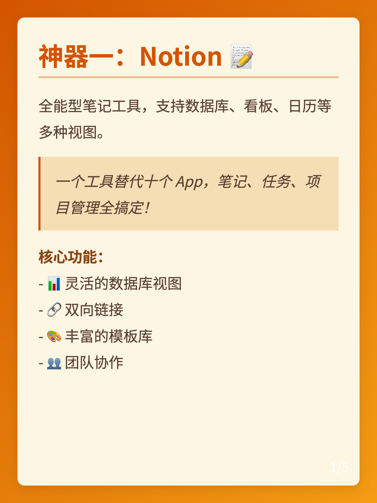
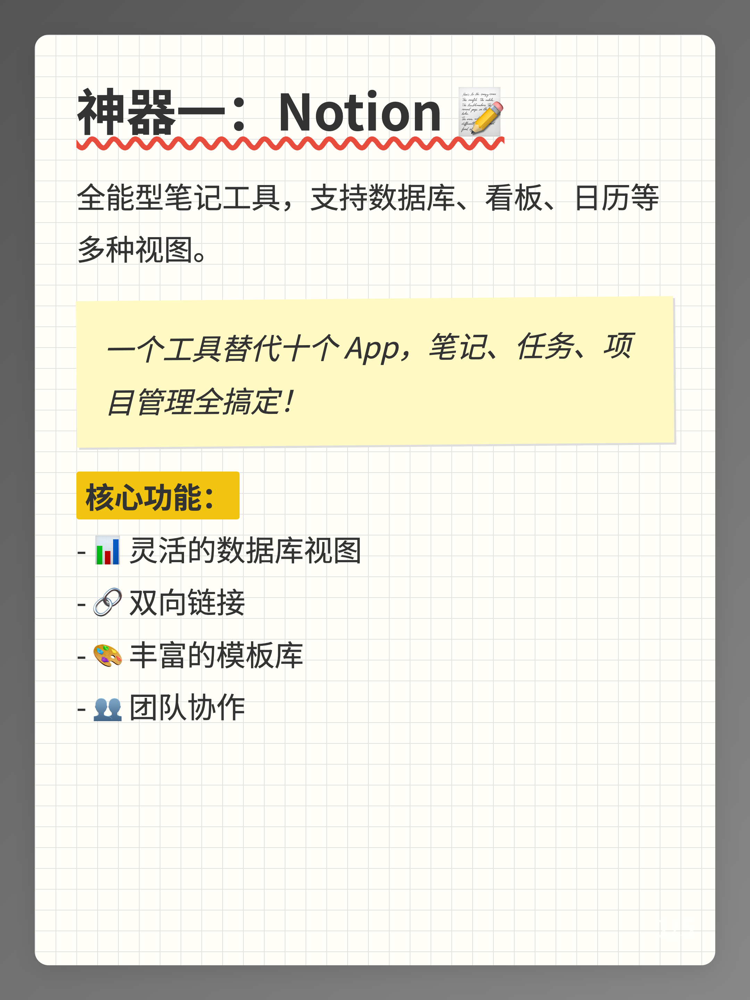

## Auto-Redbook-Skills

### ⚠️ 使用此工具前请确保已悉知官方 3 月 10 日发布的公告

公告地址：[关于打击AI托管运营账号的治理公告](http://xhslink.com/o/7WxTddvbmTu)

---

本项目包含两个小红书创作技能，各司其职：

| 技能 | 定位 | 适用场景 |
|------|------|----------|
| **xhs-note-creator** | 文字笔记创作与发布 | 撰写文案 → 排版渲染卡片 → 发布小红书 |
| **baoyu-xhs-images** | AI 图文卡片生成 | AI 生成插画/卡通/手绘风格的原创配图 |

---

## 安装

### 方式一：Claude Code Plugin 安装（推荐）

```bash
# 添加本仓库为 marketplace
/plugin marketplace add comeonzhj/Auto-Redbook-Skills

# 安装插件
/plugin install auto-redbook-skills@comeonzhj-Auto-Redbook-Skills
```

安装后运行 `/reload-plugins` 即可使用。

### 方式二：一句话安装

跟你的 Agent 说：

> 拉取下面的项目，安装其中的技能：https://github.com/comeonzhj/Auto-Redbook-Skills

### 方式三：手动安装

```bash
git clone https://github.com/comeonzhj/Auto-Redbook-Skills.git
cd Auto-Redbook-Skills
```

可以将本项目放到支持 Skills 的客户端目录，例如：

- Claude：`~/.claude/skills/`
- Alma：`~/.config/Alma/skills/`
- TRAE：`/your-path/.trae/skills/`

### 安装依赖

**Python：**

```bash
pip install -r requirements.txt
playwright install chromium
```

**Node.js：**

```bash
npm install
npx playwright install chromium
```

---

## 技能一：xhs-note-creator（文字笔记创作与发布）

以文字内容为主的笔记场景：干货分享、知识科普、清单排行、教程步骤等。

### 工作流程

1. 撰写小红书笔记文案（标题 + 正文 + 标签）
2. 生成渲染用 Markdown 文档
3. 通过本地脚本渲染图片卡片（8 种主题 + 4 种分页模式）
4. 可选发布到小红书

### 渲染图片（Python）

核心脚本：`skills/xhs-note-creator/scripts/render_xhs.py`

```bash
# 最简单用法（默认主题 + 手动分页）
python skills/xhs-note-creator/scripts/render_xhs.py demos/content.md

# 使用自动分页（推荐：内容长短难控）
python skills/xhs-note-creator/scripts/render_xhs.py demos/content.md -m auto-split

# 使用固定尺寸自动缩放（auto-fit）
python skills/xhs-note-creator/scripts/render_xhs.py demos/content_auto_fit.md -m auto-fit

# 切换主题（例如 Playful Geometric）
python skills/xhs-note-creator/scripts/render_xhs.py demos/content.md -t playful-geometric -m auto-split

# 自定义尺寸和像素比
python skills/xhs-note-creator/scripts/render_xhs.py demos/content.md -t retro -m dynamic --width 1080 --height 1440 --max-height 2160 --dpr 2
```

**主要参数：**

| 参数 | 简写 | 说明 |
|------|------|------|
| `--theme` | `-t` | 可用主题：`default`、`playful-geometric`、`neo-brutalism`、`botanical`、`professional`、`retro`、`terminal`、`sketch`、`glassmorphism` |
| `--mode` | `-m` | 分页模式：`separator` / `auto-fit` / `auto-split` / `dynamic` |
| `--width` | `-w` | 图片宽度（默认 1080） |
| `--height` |  | 图片高度（默认 1440，`dynamic` 为最小高度） |
| `--max-height` |  | `dynamic` 模式最大高度（默认 2160） |
| `--dpr` |  | 设备像素比，控制清晰度（默认 2） |

> 生成结果：封面 `cover.png` + 正文卡片 `card_1.png`、`card_2.png`...

### 渲染图片（Node.js）

脚本：`skills/xhs-note-creator/scripts/render_xhs.js`，参数与 Python 基本一致：

```bash
# 默认主题 + 手动分页
node skills/xhs-note-creator/scripts/render_xhs.js demos/content.md

# 指定主题 + 自动分页
node skills/xhs-note-creator/scripts/render_xhs.js demos/content.md -t terminal -m auto-split
```

### 发布到小红书

**1. 配置 Cookie**

```bash
cp env.example.txt .env
```

编辑 `.env`：

```env
XHS_COOKIE=your_cookie_string_here
```

> 获取方式 1（推荐）：运行 `python skills/xhs-note-creator/scripts/quick_login.py` 自动获取。
> 获取方式 2：浏览器登录小红书 → F12 → Network → 任意请求的 Cookie 头，复制整串。

**2. 发布**

```bash
# 从方案文件读取文案（推荐）
python skills/xhs-note-creator/scripts/publish_xhs.py \
  --note note.md --images cover.png card_1.png card_2.png

# 手动指定标题和描述
python skills/xhs-note-creator/scripts/publish_xhs.py \
  --title "笔记标题" --desc "笔记描述" --images cover.png card_1.png
```

**可选参数：**

| 参数 | 说明 |
|------|------|
| `--note` | 方案文件路径（Markdown/纯文本，从中读取 title 和 desc） |
| `--post-time "2024-01-01 12:00:00"` | 定时发布 |
| `--api-mode` | 通过 xhs-api 服务发布 |
| `--dry-run` | 仅验证，不实际发布 |

### 主题效果示例

> 所有示例均为 1080x1440px，小红书推荐 3:4 比例
> 更多示例去 [demo](/demos) 中查看

|||
|---|---|
|||
|||

### Auto-fit 模式示例（自动缩放）


---

## 技能二：baoyu-xhs-images（AI 图文卡片生成）

AI 生成插画/卡通/手绘配图的图文并茂内容：种草分享、手绘笔记、知识图解、视觉冲击封面等。

支持 12 种视觉风格、8 种信息布局和 3 种配色方案，通过 AI 图像生成工具创建 1-10 张风格化图片卡片。

详见 `skills/baoyu-xhs-images/SKILL.md`。

---

## 项目结构

```
Auto-Redbook-Skills/
├── SKILL.md                          # 项目根技能描述（指向 xhs-note-creator）
├── README.md                         # 项目文档
├── requirements.txt                  # Python 依赖
├── package.json                      # Node.js 依赖
├── env.example.txt                   # Cookie 配置示例
├── demos/                            # 各主题示例渲染结果
│   ├── content.md
│   ├── content_auto_fit.md
│   ├── auto-fit/
│   ├── playful-geometric/
│   ├── retro/
│   ├── Sketch/
│   └── terminal/
├── skills/
│   ├── xhs-note-creator/             # 文字笔记技能
│   │   ├── SKILL.md
│   │   ├── scripts/
│   │   │   ├── render_xhs.py         # Python 渲染（8 主题 + 4 分页）
│   │   │   ├── render_xhs_v2.py      # Python 渲染 V2（渐变色彩风格）
│   │   │   ├── render_xhs.js         # Node.js 渲染
│   │   │   ├── render_xhs_v2.js      # Node.js 渲染 V2
│   │   │   └── publish_xhs.py        # 小红书发布脚本
│   │   ├── assets/
│   │   │   ├── cover.html            # 封面 HTML 模板
│   │   │   ├── card.html             # 正文卡片 HTML 模板
│   │   │   ├── styles.css            # 公共容器样式
│   │   │   ├── example.md            # 示例 Markdown
│   │   │   └── themes/               # 主题样式
│   │   │       ├── default.css
│   │   │       ├── playful-geometric.css
│   │   │       ├── neo-brutalism.css
│   │   │       ├── botanical.css
│   │   │       ├── professional.css
│   │   │       ├── retro.css
│   │   │       ├── terminal.css
│   │   │       └── sketch.css
│   │   └── references/
│   │       └── params.md             # 完整参数参考
│   └── baoyu-xhs-images/             # AI 图文卡片技能
│       ├── SKILL.md
│       └── references/               # 风格/布局/配色参考文档
```

---

## 注意事项

1. **Cookie 安全**：不要把 `.env` 提交到 Git 或共享出去。
2. **Cookie 有效期**：过期后发布失败是正常现象，重新抓一次 Cookie 即可。
3. **发布频率**：避免短时间内高频发布，以免触发平台风控。
4. **图片尺寸**：默认 1080x1440px，符合小红书推荐比例。

---

## 致谢

- [Playwright](https://playwright.dev/) - 浏览器自动化渲染
- [Marked](https://marked.js.org/) - Markdown 解析
- [xhs](https://github.com/ReaJason/xhs) - 小红书 API 客户端
- **Cursor** - 渲染脚本重构过程中提供了极大帮助

---

## License

MIT License
